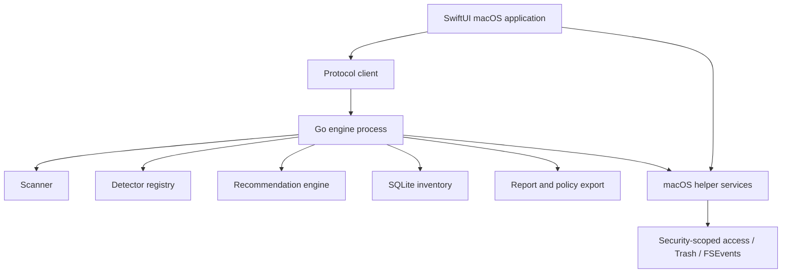

# Architecture and Technology Stack

Status: Proposed  
Last updated: 2026-07-13

## Decision

Use a native SwiftUI macOS application with a Go core engine. Do not introduce Rust for the initial implementation.

The Go engine is independently usable as a CLI and communicates with the Swift application through a versioned local protocol. Swift owns the macOS application lifecycle and platform integrations. Go owns scanning, detection, analysis (including tool portfolio and fit scoring), persistence, recommendation generation, and report export.

## Why Go is sufficient

Filesystem inventory is predominantly constrained by storage latency, metadata operations, hashing I/O, and database throughput. The main performance gains will come from:

- Avoiding unnecessary filesystem calls.
- Bounded parallel traversal.
- Not following irrelevant paths.
- Batching SQLite writes.
- Incremental indexing.
- Staged hashing.
- Correct hard-link and APFS accounting.
- Avoiding repeated parsing and subprocess execution.

Rust could reduce CPU or memory overhead in tightly optimized components, but it would add a second backend language before a demonstrated bottleneck exists. Go offers:

- Excellent filesystem and concurrency primitives.
- A straightforward single-binary CLI.
- Fast development for the current maintainer.
- Strong cross-compilation and test tooling.
- Simple profiling with `pprof` and execution tracing.
- Mature SQLite, Git, hashing, and serialization packages.

The project should add Rust only after benchmarks identify a hotspot that cannot be fixed acceptably in Go or with a narrow native macOS API bridge.

## Why native SwiftUI

The product is macOS-specific and needs high-quality integration with:

- Full Disk Access guidance.
- Security-scoped bookmarks for selected folders.
- App Sandbox decisions.
- Trash and Finder behavior.
- Notifications and background tasks.
- Accessibility and system appearance.
- Keychain for optional provider credentials.
- FSEvents and other macOS APIs.

SwiftUI provides a more appropriate long-term UI than an embedded web view. It avoids shipping a browser runtime and produces a UI that behaves like a Mac application. Swift should remain a thin client/platform layer rather than duplicate analysis logic.

## High-level design



## Process boundary

### Recommended initial boundary

Ship the Go engine as a child executable inside the application bundle. The Swift app launches it and communicates over newline-delimited JSON-RPC on stdin/stdout.

Advantages:

- The engine is also directly testable as a CLI.
- A crash in scanning does not necessarily crash the UI.
- No C ABI or cgo integration layer is required.
- Protocol traffic can be recorded in tests.
- The UI and engine can negotiate versions.
- The CLI remains useful for automation and headless reports.

Requirements:

- Stdout is reserved for protocol messages; diagnostics go to stderr or structured log files.
- Every request has an ID and cancellation token.
- Long-running operations emit progress events.
- The UI validates the bundled executable before launch through normal code signing.
- Only the parent application may connect in the initial release.

### Future boundary

If background monitoring must survive UI termination, promote the engine to a signed LaunchAgent using XPC for lifecycle and authorization. Do not begin with a privileged helper. Ordinary scans should run as the current user.

### Rejected initial alternatives

- Go shared library through cgo: tighter coupling, complex memory ownership, more difficult crash isolation, and awkward async callbacks.
- Wails or another web UI: faster for web teams, but less suitable for deep macOS integration and adds a web runtime abstraction the project does not need.
- All Swift: excellent platform integration, but slower development for the maintainer and less reusable headless logic.
- Swift UI plus Rust backend: technically strong but increases implementation cost without a measured performance need.
- Electron: excessive steady-state memory and bundle size for a disk-optimization product.

## Components

### Swift application

Responsibilities:

- Onboarding and filesystem permission UX.
- Security-scoped bookmark storage.
- Launching and supervising the Go engine.
- Dashboard, asset browser, graph views, recommendation details, and plans.
- User approval and confirmation flows.
- Native Trash operations where used.
- Notifications and background scheduling.
- Keychain access for explicitly enabled integrations.
- Accessibility and localization.

Suggested technologies:

- Swift 6.
- SwiftUI with Observation.
- Swift Charts for trends and storage breakdowns.
- OSLog for local diagnostics.
- XCTest and Swift Testing.
- Xcode project initially; consider Swift Package Manager for reusable Swift modules.

### Go engine

Responsibilities:

- Filesystem traversal and allocated-size accounting.
- Detector execution.
- Git inspection.
- Manifest and lockfile parsing.
- Asset graph construction.
- Recommendation rules and confidence calculation.
- SQLite persistence and migrations.
- JSON report and policy handling.
- CLI UX.
- Operation planning and, after MVP, guarded execution.

Suggested module layout:

```text
cmd/devhearth/           CLI entry point
internal/protocol/       Versioned UI protocol
internal/scan/           Traversal and metadata collection
internal/detect/         Detector interfaces and registry
internal/detect/git/     Git repositories and worktrees
internal/detect/node/    Node manifests, package managers, and stores
internal/detect/python/  Python environments and package tools
internal/detect/runtime/ Version managers and runtime installations
internal/detect/ai/      Models, datasets, and AI tools
internal/assets/         Asset and relationship model
internal/portfolio/      Tool portfolio aggregation and fit scoring
internal/recommend/      Deterministic recommendation rules
internal/policy/         Portable policy parsing
internal/store/          SQLite repository and migrations
internal/report/         JSON and human-readable output
internal/platform/       Platform interfaces
internal/platform/darwin macOS-specific implementation
```

Suggested Go technologies:

- Standard library traversal as the baseline; benchmark before adopting a specialized walker.
- `golang.org/x/sys/unix` for Darwin metadata not exposed by the standard library.
- SQLite in WAL mode. Prefer a pure-Go driver if profiling shows acceptable behavior; otherwise evaluate a cgo-backed driver for the packaged macOS build.
- Native `git` subprocess calls for authoritative advanced status in the first version, behind an interface. Avoid reimplementing all Git semantics prematurely.
- `encoding/json` for protocol compatibility; optimize serialization only if profiles justify it.
- `slog` for structured engine logging.

## macOS-specific helper boundary

Some features are better implemented with Apple APIs. Expose a narrow helper interface rather than spreading platform calls through Go:

- Resolve security-scoped bookmarks.
- Move approved items to Trash.
- Subscribe to FSEvents for incremental invalidation.
- Reveal an asset in Finder.
- Query volume capabilities and APFS metadata where public APIs provide useful information.
- Present permission state to the user.

For the MVP, the Swift app can grant the engine explicit resolved paths and retain platform-only actions. If sandboxing prevents the child process from inheriting necessary access reliably, evaluate an XPC service or perform affected metadata calls in Swift.

## Data model

Core entities:

```text
Scan
Volume
FilesystemEntry
Asset
AssetLocation
Relationship
Project
Manifest
ToolInstallation
RuntimeInstallation
PackageManagerInstallation
DependencyStore
DependencyEnvironment
ContainerResource
AIAsset
PortfolioSummary
FitAssessment
Evidence
Recommendation
Plan
Operation
Policy
AuditEvent
```

An asset is a logical object; locations are paths or runtime identifiers. This allows one model digest, runtime, or Git repository to have several physical locations without pretending those locations are independent assets.

`ToolInstallation` is the common supertype for discovered tools. `RuntimeInstallation`, `PackageManagerInstallation`, and `DependencyStore` specialize it so recommendations can treat version managers, package managers, and stores as distinct classes (see product taxonomy in SPECS).

`PortfolioSummary` aggregates installed tools, in-use project counts, and storage by class for an ecosystem. `FitAssessment` stores ranked options, factor scores, blockers, savings ranges, and the stay-put baseline for a portfolio or project set. Fit assessments feed recommendations; they never authorize mutation.

Relationships use typed edges such as:

- `project_requires_runtime`
- `project_uses_package_manager`
- `project_owns_environment`
- `manifest_restores_environment`
- `store_serves_projects`
- `tool_duplicates_capability`
- `tool_manages_runtime`
- `compose_references_image`
- `volume_may_belong_to_project`
- `location_exactly_duplicates_location`
- `asset_downloadable_from_source`
- `worktree_belongs_to_repository`
- `recommendation_affects_asset`
- `fit_assessment_ranks_tool`

Every inferred relationship carries evidence, confidence, detector version, and scan ID.

## Detector model

Detectors are Go implementations registered by capability. A detector must declare:

- Stable identifier and version.
- Paths or evidence that trigger it.
- Cost class.
- Whether content reads are required.
- Assets and relationships it can produce.
- Risk implications.

Detector results must not directly delete or migrate anything. Operation planners consume validated assets later.

Avoid an unrestricted third-party plugin system initially. Filesystem scanners execute with broad user permissions; in-process plugins would inherit those permissions. Declarative detectors may be considered after the schema and threat model stabilize.

## Scanning strategy

### Phase 1: Volume and scope discovery

- Identify selected roots and volume boundaries.
- Record filesystem capabilities.
- Load exclusion policy.
- Mark inaccessible scopes.

### Phase 2: Metadata traversal

- Enumerate paths with bounded workers.
- Gather type, size, allocated blocks, modification time, inode/file ID, and link count.
- Avoid content reads.
- Aggregate directory totals incrementally.

### Phase 3: Development detection

- Run cheap signature detectors against names and metadata.
- Parse manifests only in candidate directories.
- Detect version managers, package managers, dependency stores, and caches.
- Associate project-local environments and outputs.

### Phase 4: Relationship and portfolio analysis

- Inspect Git state.
- Associate runtime requirements and package-manager usage.
- Build per-ecosystem portfolio summaries (installed, in-use, storage by class).
- Associate containers and AI stores.
- Group exact and likely duplicates using staged evidence.
- Run fit scoring where deep analysis is enabled for the ecosystem.

### Phase 5: Recommendations

- Execute deterministic rules, including portfolio-fit and shared-store rules.
- Calculate confidence, savings range, restoration cost, blockers, and risk.
- Persist evidence, fit assessments, and explanations.

## Performance plan

Do not select Rust based on intuition. Establish representative benchmarks:

1. Synthetic trees with one million and ten million small entries.
2. Large monorepos with deep `node_modules` trees.
3. Many Python virtual environments.
4. Sparse files and large VM disk images.
5. Hard links and APFS clones.
6. External SSDs and slow volumes.
7. Warm incremental scans.

Measure:

- Wall-clock time.
- Filesystem calls per entry.
- Allocations and peak resident memory.
- Database time and transaction count.
- CPU and energy impact.
- Cancellation latency.
- Effect on foreground builds.

Optimization order:

1. Correct unnecessary work.
2. Tune concurrency and batching.
3. Improve data structures and allocations.
4. Add platform-specific metadata calls.
5. Only then evaluate replacing a measured component with Rust.

## Protocol outline

Example request:

```json
{"jsonrpc":"2.0","id":"42","method":"scan.start","params":{"roots":["/Users/example/Projects"],"policyId":"default"}}
```

Example progress event:

```json
{"jsonrpc":"2.0","method":"scan.progress","params":{"scanId":"scan_01","phase":"metadata","entriesVisited":120034,"allocatedBytes":9834475520}}
```

Initial methods:

- `engine.hello`
- `scan.start`
- `scan.cancel`
- `scan.status`
- `assets.list`
- `assets.get`
- `portfolio.list`
- `portfolio.get`
- `fit.list`
- `fit.get`
- `recommendations.list`
- `recommendations.get`
- `report.export`
- `policy.validate`
- `policy.export`

Mutation methods must be introduced in a later protocol version.

Phase 0 implements only `engine.hello`, mocked `scan.start`, and `scan.progress`. Cancellation, status queries, inventory methods, and exports begin with their owning roadmap phases; accepting a cancellation token in Phase 0 reserves the wire shape but does not imply cancellation support.

## Repository layout

```text
apps/macos/               SwiftUI application
cmd/devhearth/            Go CLI
internal/                 Go engine internals
pkg/                      Public Go packages only if a real consumer appears
docs/                     Product and engineering documentation
testdata/                 Synthetic detector fixtures
scripts/                  Developer automation
```

Keep the Swift and Go builds independently testable. The release build copies the signed Go binary into the application bundle.

## Distribution

Begin with signed and notarized direct distribution. Full Disk Access and bundled child-process behavior should be validated before promising Mac App Store support. A Homebrew cask can install the app, and a separate formula may install the CLI if desired.

Support Apple Silicon first. Keep the Go engine architecture-neutral and avoid unnecessary assumptions so an Intel build remains possible, but do not let universal-binary support delay the MVP.

## Technology decision summary

| Area | Choice | Reason |
|---|---|---|
| UI | SwiftUI | Native macOS behavior and permissions |
| Core | Go | Maintainer strength, sufficient performance, strong CLI story |
| UI/core boundary | Child process + JSON-RPC | Isolation, testability, independent CLI |
| Persistence | SQLite | Local, queryable, transactional, portable |
| Incremental updates | FSEvents via Swift/native bridge | Native macOS filesystem notifications |
| Rules | Deterministic Go | Auditable safety and testability |
| Portfolio fit | Deterministic Go scoring | Multi-factor ranks with stay-put; never absolute “best tool” |
| AI | Optional explanation layer | Never safety authority or fit-score authority |
| Rust | Deferred | Add only for a proven hotspot |
